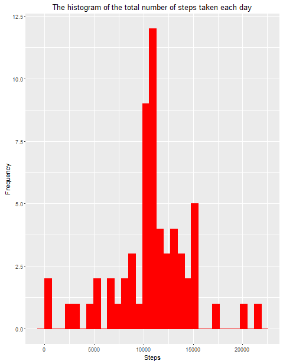

# Reproducible Research: Peer Assessment 1

## Loading and preprocessing the data

```r
if(!file.exists('activity.csv')){
    unzip('activity.zip')
}
data <- read.csv("activity.csv", header = TRUE)
```

## What is mean total number of steps taken per day?
```{r}
data_date <- ddply(data, c("date"), summarize, steps = sum(steps))
plot1 <- function(){
  ggplot(data_date, aes(steps)) + geom_histogram(fill = "green", colour = "green") +
    xlab("Steps") + ylab("Frequency") +
    ggtitle("The histogram of the total number of steps taken each day")
}
plot1()
```


The mean and median of the total number of steps taken per day:
```{r}
mean_steps <- mean(data_date$steps, na.rm = TRUE)
median_steps <- median(data_date$steps, na.rm = TRUE)
```

```{r}
mean_steps
```

```
## [1] 10766.19
```
```{r}
median_steps
```

```
## [1] 10766
```

## What is the average daily activity pattern?
```{r}
data_remove_na <- data[complete.cases(data),]
data_interval <- ddply(data_remove_na, c("interval"), summarize, steps = sum(steps) / 61)

plot2 <- function(){
  ggplot(data_interval, aes(interval, steps)) + geom_line(colour = "red") + xlab("5-min Interval") + ylab("Steps") +
    ggtitle("The average number of steps taken by 5-minutes interval")
}
plot2()
```


On average across all the days in the dataset, the 5-minute interval contains
the maximum number of steps?
```{r}
data_interval[which.max(data_interval$steps),]
```
```
##     interval    steps
## 104      835 206.1698
```

## Imputing missing values
The number of missing values
```{r}
sum(!complete.cases(data))
```
```
## [1] 2304
```
```{r}
data_new <- data
data_new$steps[is.na(data_new$steps)] <- mean(data_new$steps, na.rm = TRUE) # na = average steps of interval
data_new_date <- ddply(data_new, c("date"), summarize, steps = sum(steps))
plot3 <- function(){
  ggplot(data_new_date, aes(steps)) + geom_histogram(fill = "red", colour = "red") + xlab("Steps") + ylab("Frequency") +
    ggtitle("The histogram of the total number of steps taken each day")
}
plot3()
```
 
```{r}
mean_new_steps <- mean(data_new_date$steps, na.rm = TRUE)
```
```{r}
mean_new_steps
```
```
## [1] 10766.19
```
```{r}
median_new_steps <- median(data_new_date$steps, na.rm = TRUE)
```
```{r}
median_new_steps
```

```
## [1] 10766.19
```
Median values is a little bit higher after imputing missing data and the mean does not change. 
The reason is that in the original data, there are some days with `steps` values `NA` for 
any `interval`. The total number of steps taken in such days are set to 0s by
default. However, after replacing missing `steps` values with the mean `steps`
of `interval` value, these 0 values are replaced by the average steps
of total number of steps taken each day.

## Are there differences in activity patterns between weekdays and weekends?
```{r}
data_new <- data
data_new$steps[is.na(data_new$steps)] <- mean(data_new$steps, na.rm = TRUE)
data_interval <- ddply(data_remove_na, c("interval"), summarize, steps = sum(steps) / 61)
data_new$date <- as.Date(data_new_date$date)

data_new$Weekday <- weekdays(data_new$date)
weekday_list <- c("Monday", "Tuesday", "Wednesday", "Thursday", "Friday")
data_new$Weekday <- factor(data_new$Weekday %in% weekday_list, 
                                levels = c(TRUE, FALSE), labels = c("Weekday", "Weekend"))

data_new_interval <- ddply(data_new, c("Weekday","interval"), summarize, steps = sum(steps) / 61)
plot4 <- function(){
  xyplot(steps ~interval | factor(Weekday), data = data_new_interval, type = "l",
         main = "The average number of steps taken by 5-minutes interval",
         xlab = "Number of Steps", ylab = "Interval")
}
plot4()
```
 
